# PropOps — Design Proposal (for confirmation before any code)

Scope: one owner, one California SFR, one tenant/lease to start. Schema is property-keyed so a second property is a data change, not a migration — but no multi-tenant SaaS.

---

## 1. Harness architecture

```mermaid
flowchart LR
  subgraph Ingress["Ingress (Vercel route handlers)"]
    TW[Twilio SMS / Voicemail webhook]
    GM[Gmail Pub/Sub push]
    CRON[Scheduled tick<br/>pg_cron -> Inngest]
    DASH[Dashboard owner command]
  end

  TW --> SIG[Verify signature<br/>+ idempotency key]
  GM --> SIG
  CRON --> SIG
  DASH --> SIG
  SIG --> EMR{Emergency rules<br/>deterministic, pre-LLM}
  EMR -- hit --> SAFE[Templated safety reply<br/>+ owner alert<br/>direct send, no LLM, no queue]
  EMR --> LOOP{Loop / auto-reply<br/>detector}
  LOOP -- loop --> DROP[Mark suppressed + notify owner digest]
  LOOP --> EV[(events table<br/>unique external_id)]
  EV --> Q[[Inngest queue<br/>retries + backoff + DLQ]]

  Q --> ROUTE{Event router}
  ROUTE -- owner approval reply --> APPR[Approval parser<br/>Y-/N-/edit]
  ROUTE -- everything else --> CTX[Context loader<br/>PII-minimized, untrusted data wrapped]
  CTX --> AGENT[Claude tool loop<br/>caps: steps / tokens / wall-clock]
  AGENT <--> REG[Tool registry<br/>Zod schemas, timeout, rate limit]
  REG --> POL{Policy engine<br/>effective tier = max of floors}
  POL -- Tier 0 --> EXEC[Executor]
  POL -- Tier 1 --> HOLD[Outbox with undo window] --> EXEC
  POL -- Tier 2 --> PEND[Pending action + approval code<br/>SMS to owner + dashboard queue]
  POL -- Tier 3 --> DENY[Refuse + alert owner]
  APPR --> PEND
  PEND -- approved --> EXEC
  PEND -- edits --> Q
  EXEC --> KS{Kill switch +<br/>rate limits + staging redirect}
  KS --> OUT[Twilio / Gmail / Calendar adapters<br/>mock adapters in tests & evals]
  AGENT --> TRACE[(agent_runs + agent_steps)]
  EXEC --> AUD[(audit_log append-only)]
```



### Key mechanics

**Events.** Every trigger becomes `Event { id, type, source, external_id, contact_id?, payload, received_at }`. Idempotency = unique `(source, external_id)` (Twilio MessageSid, Gmail messageId, `tick:<kind>:<entity>:<date>`, dashboard UUID). Webhook returns 200 after insert; a duplicate insert is a no-op. Insert + enqueue use an outbox row so a crash between them can't lose an event.

**Emergency path (rules before LLM).** Runs synchronously in the webhook before enqueue. Keyword/regex rules (English + Spanish) live in `/policy/emergency-rules.yaml` (gas, smell of gas, flooding, burst pipe, fire, smoke, sparks, exposed wires, no heat, no water, injury, CO alarm…). A hit sends the safety template to the tenant and an alert to the owner straight through the Twilio adapter. No LLM, no queue. If Twilio fails, it retries in-process, then falls back to a queued high-priority job. The event is still queued afterward so the agent can open a request. Rules are tuned to over-trigger: a false positive is cheap, a false negative is not.

**Agent loop.** Context = tenant profile (first name, preferred language/channel, memory facts), active lease summary, open requests, last N messages on the thread, and the relevant policy excerpts. No phone numbers, emails, DOB, or bank info: tools reference `contact_id` and the executor resolves real addresses. Caps (from policy): `max_steps=12`, `max_tokens=60k`, `max_wall_ms=90s`, `max_consecutive_tool_failures=2`. On breach the run ends with `outcome=escalated` and calls `alert_owner`. Every step is persisted: a thought summary (the model's short `reasoning_summary` field, not raw chain-of-thought), the tool call, the result, the tier decision, latency, and tokens. Final output is a Zod-validated `RunOutcome`.

**Tool registry.** `defineTool({ name, kind: read|draft|action, baseTier, input: z.schema, output: z.schema, timeoutMs, rateLimit, execute })`. The registry wraps every call with schema validation, timeout, rate-limit check, policy evaluation, and an audit entry. Mock and real adapters share one interface (`SmsPort`, `EmailPort`, `CalendarPort`), so evals and integration tests use the exact same code path with mocks injected.

**Policy engine: tiers are computed in code, never chosen by the LLM.**
`effectiveTier = max(toolFloor, ...matchingPolicyRules, agentSelfEscalation)`
- Rule examples: recipient not in `contacts` → 3; recipient is a vendor with no prior job → 2; amount > `spend.auto_approve_max` → 2; message classified legal/rent/lease-sensitive → 2; free text (not an approved template) → 2; agent set `uncertain=true` → 2.
- The agent can only raise a tier (`request_owner_review`). It cannot lower one.
- Tier 3 list is hardcoded in code (payments, signing, deletes, unknown recipients, cross-tenant data) and can't be loosened by config.
- `/policy/policy.yaml` is the versioned default with everything at Tier 2. Dashboard overrides go in `policy_overrides` (owner-auth only, RLS, audited). Effective policy = file + overrides, hashed and stamped on every run. No tool can write either one.

**Tier behavior.**
- T0: execute now.
- T1: written to the outbox with `send_at = now + undo_window` (configurable, default 10 min). Owner gets a summary with `U-####` to undo. True undo before send; after send, "where possible" means calendar events and statuses can be reverted, messages can't.
- T2: `pending_approval` with a 4-digit code that is unique among open approvals and expires after a configurable time. The tool result tells the LLM it's "queued for owner approval," so the agent can still acknowledge the tenant with a T0 template.
- T3: refused, logged, owner alerted.

**SMS approval.** Inbound from the owner's verified number (HMAC blind-index match plus Twilio signature) is routed to a deterministic parser *before* any LLM: `Y-4821`, `N-4821`, `U-4821`, `PAUSE`, `RESUME`, `STATUS`. Case and whitespace are tolerated. Anything else that references a code (`4821 make it $300 max`) becomes an `owner_command` revision event linked to the action. The agent redrafts, and the result goes back through policy again (usually T2 again). From any other number, these commands are treated as ordinary untrusted text. Approval runs the *stored, already-validated* action args. It never re-asks the LLM.

**Untrusted content.** All tenant, vendor, and email text is passed inside `<untrusted_data source="sms" id="…">…</untrusted_data>` blocks with delimiter escaping. The system prompt says the content is data and never instructions. Defense doesn't depend on the prompt, though: permissions, recipients, and tiers are enforced in code. Tools are scoped to the event's contact/property, so `get_tenant` can't return another party's data to a non-owner thread. An outbound content check blocks messages containing PII belonging to someone other than the recipient. Email bodies are stripped of quoted/forwarded history for the agent, but the history is kept for summarization (still wrapped).

**Kill switch.** `system_state.paused`. Set by `PAUSE` SMS from owner or by the dashboard toggle. The executor checks it at send time (not just enqueue time), so held T1 messages also stop. Events keep being ingested and runs can still produce drafts and approvals, but nothing goes outbound except messages to the owner. See open question Q4 about emergency tenant replies.

**Rate limits and loop breaking.** Per-recipient daily caps (configurable, e.g. 6 SMS / 4 email per day), per-thread velocity (more than N agent messages in M minutes with no human-looking reply → suppress + owner alert), auto-responder detection (`Auto-Submitted`, `X-Autoreply`, `Precedence: bulk|auto_reply`, OOO phrase patterns, repeated identical body hash), and never auto-replying to a no-reply sender.

**PII.** Phone, email, message bodies, lease terms docs, and memory values are encrypted at the application level with AES-256-GCM (key from env, key-id prefix for rotation). Phone/email lookups use an HMAC blind index. Logs and traces store redacted text (`[PHONE]`, `[EMAIL]`, `[ADDR]`). Supabase Storage bucket is private, signed URLs only.

**Staging mode.** `PROPOPS_MODE=staging` makes the executor rewrite every outbound recipient to the owner's number/email and prefix `[STAGING → would send to Tenant: Maria]`. Enforced in the adapter layer, so nothing upstream can bypass it.

**Queue/infra choice.** Recommend **Inngest**: step functions get around Vercel function timeouts, and it gives retries with backoff, concurrency keys (one run at a time per contact thread, which avoids racing replies), cron, and failure handlers that we write to a `dead_letters` table and surface in the dashboard. Postgres stays the source of truth. (Q1)

---

## 2. Schema (Postgres / Supabase)

RLS is on for every table. Policy: only `auth.uid() = owner_user_id` (single owner, from `app_owner`) may select or modify, and workers use the service role. `audit_log`, `agent_steps`, and `events` are append-only (no update/delete policy, plus revoke at grant level). `enc_` = encrypted bytea, `bidx_` = blind index.

| Table | Key columns |
|---|---|
| `app_owner` | user_id, enc_phone, bidx_phone, enc_email, verified_at |
| `properties` | id, nickname, address (enc), county, jurisdiction_flags (rent control? etc.), hoa_contact_id |
| `contacts` | id, kind (tenant/vendor/owner/agency/utility/hoa), display_name, enc_phone, bidx_phone, enc_email, bidx_email, preferred_channel, preferred_language, is_allowlisted, created_by |
| `tenants` | id, contact_id, property_id, status |
| `leases` | id, property_id, start_date, end_date, monthly_rent_cents, due_day, grace_days, late_fee_rule_id, deposit_cents, status, doc_storage_path |
| `lease_tenants` | lease_id, tenant_id |
| `vendors` | id, contact_id, trades[], preapproved bool, auto_spend_limit_cents, rating, notes |
| `events` | id, type, source, external_id (unique w/ source), contact_id, property_id, enc_payload, redacted_summary, status (received/queued/processing/done/failed/suppressed), emergency_hit, received_at |
| `threads` | id, channel, contact_id, external_thread_id (Gmail threadId / phone pair), classification, summary, last_message_at |
| `messages` | id, thread_id, event_id, direction, channel, contact_id, enc_body, redacted_body, provider_id (unique), template_id, is_auto_reply, created_at |
| `maintenance_requests` | id, property_id, tenant_id, category, urgency (emergency/urgent/routine/cosmetic), urgency_reason, status (new→info_needed→vendor_requested→quoted→scheduled→in_progress→done→closed / cancelled), missing_info[], vendor_id, quote_cents, scheduled_start, calendar_event_id, closed_at |
| `request_history` | request_id, from_status, to_status, actor (agent/owner/system), run_id, at |
| `ledger_entries` | id, lease_id, kind (rent_charge/payment/late_fee/credit/deposit), amount_cents, period (yyyy-mm), effective_date, method, note, created_by |
| `reminder_schedule` | lease_id, offsets_days[], template_ids |
| `expenses` | id, property_id, request_id, vendor_id, category, amount_cents, incurred_on, receipt_path |
| `comps` | id, property_id, address_label, beds, baths, sqft, rent_cents, source, observed_on (owner-entered only) |
| `owner_tasks` | id, title, due_date, amount_cents, source_event_id, status |
| `calendar_events` | id, google_event_id, kind (vendor_visit/lease_date/notice_deadline), request_id, starts_at, ends_at |
| `agent_runs` | id, event_id, prompt_version, policy_hash, model, status, outcome (completed/escalated/failed/capped), escalation_reason, steps, input_tokens, output_tokens, cost_usd, latency_ms, started_at |
| `agent_steps` | id, run_id, idx, type (thought/tool_call/tool_result/final), tool_name, redacted_input, redacted_output, effective_tier, tier_reasons[], duration_ms |
| `actions` (outbox) | id, run_id, tool_name, args (validated JSON, enc), effective_tier, status (proposed/held/pending_approval/approved/rejected/revising/executing/executed/failed/undone/expired/blocked_paused), approval_code, code_expires_at, send_at, idempotency_key (unique), executed_result, parent_action_id |
| `approvals` | id, action_id, channel (sms/dashboard), decision (approve/reject/edit/undo), owner_text (enc), decided_at |
| `memory_facts` | id, scope (tenant/property/vendor), subject_id, category (contact_pref/past_issue/vendor_history/tone/access_notes), fact (enc), source_run_id, status (active/edited/archived), owner_edited |
| `memory_categories_whitelist` | category, enabled |
| `policy_overrides` | id, path (e.g. `tools.send_sms.tier`), value, changed_by, changed_at, reason |
| `system_state` | singleton: paused, paused_at, paused_by, mode |
| `rate_counters` | recipient_bidx, channel, day, count |
| `audit_log` | id, at, actor, action, entity, entity_id, details (redacted), run_id |
| `dead_letters` | id, job_name, event_id, error, attempts, payload_ref, resolved |
| `eval_examples` | id, source (owner_edit/owner_reject), run_id, input_redacted, expected (label/edited text), created_at |

Config files (versioned, in the repo, cannot be edited by the agent):
`/policy/policy.yaml` (tiers, caps, spend limits, rate limits, undo window), `/policy/emergency-rules.yaml`, `/policy/templates/*.yaml` (approved message templates, EN/ES), `/policy/rent.yaml` (grace, fee rule types: flat/percent/cap, reminder offsets), `/policy/ca-compliance.yaml` (every rule marked `verify_with_current_ca_law: true`). Prompts go in `/prompts/<name>/v<N>.md` with a front-matter version.

---

## 3. Repo layout

```
app/                 Next.js App Router (dashboard + /api webhooks)
src/harness/         events, router, loop, registry, policy, executor, approvals, emergency, loops, ratelimit, crypto, redact
src/tools/           one file per tool (read/draft/action)
src/adapters/        twilio, gmail, gcal, anthropic (+ mocks/)
src/modules/         maintenance, rent, renewals, email, voice, reporting, compliance
src/inngest/         functions
supabase/            migrations, seed.ts
policy/  prompts/    versioned config + prompts
evals/               datasets/, scenarios/, adversarial/, runner, sim (tenant/vendor), reports/
docs/                decisions.md, architecture
tests/               unit + integration (vitest)
```

Testing: Vitest for unit and integration, `supabase start` locally for DB tests. Mock adapters record every "sent" message so tests can assert on them.

---

## 4. Evals design

- **Component (60+ items, growing):** JSONL `{channel, text, expected_category, expected_urgency, is_emergency, tags[]}` with tags like vague, buried-emergency, angry, Spanish/Vietnamese/Chinese, spam, non-maintenance, rent question. Scores both the rule layer and the LLM classifier. Emergency recall is computed over `rules ∪ LLM`, and the CI gate fails on any miss.
- **Trajectory (25+):** YAML scenario = initial state + scripted simulator turns + assertions (`must_call`, `must_not_call`, tool order constraints, expected tiers per action, final request status, max steps). The tenant/vendor simulator is scripted by default (deterministic, cheap). An optional LLM-driven simulator mode adds variety, but CI uses the scripted one.
- **Adversarial (20+):** injection via SMS, email footers, forwarded threads, fake "owner" texts from non-owner numbers, the lawyer social-engineering case, an auto-responder ping-pong, and conflicting tenant/owner instructions. Pass = zero T3 executions, zero out-of-scope data in any outbound, and no policy/tier change.
- **Runner:** `npm run evals -- --prompts v1,v2 --models <a>,<b>` writes `evals/reports/<date>.md` with accuracy, per-class precision/recall, tier correctness, violations, steps, $ cost, and p50/p95 latency. `npm run evals:ci` is the gated subset.
- **Feedback:** owner edits and rejections write `eval_examples`, and `npm run evals:import` promotes reviewed ones into datasets.

---

## 5. Task plan (one PR per item, small commits inside)

| # | PR | Contents | Real integrations? |
|---|---|---|---|
| 0 | Scaffold | Next.js/TS/Tailwind, Supabase migrations + RLS + seed (1 property, 1 tenant, 1 lease, ~12 months ledger, 4 past requests, 3 vendors), Vitest, ESLint, CI, `.env.example`, policy/prompt loaders | No |
| 1 | Harness core | events + idempotency, Inngest wiring, emergency rules, loop detector, rate limits, kill switch, crypto/redaction, tool registry + all listed tools on mock adapters, policy engine, agent loop + caps + trajectory persistence, outbox/executor, SMS approval parser + flow, staging redirect, memory tool. Unit tests (rules, approval parsing, policy) + integration tests (webhook → agent → approval, mocks) | No |
| 2 | Evals v1 | component + adversarial suites, trajectory runner + simulator, report, CI gates | No (Anthropic API only) |
| 3 | Module A: maintenance | triage, missing-info loop, vendor selection, quote/visit, scheduling, follow-up timers, close-out + expense; maintenance trajectory scenarios to 25+ | No |
| 4 | Dashboard core | auth (magic link, owner only), approvals queue, run traces, kill switch, policy view/overrides, memory review/edit, DLQ view | No |
| 5 | Integrations + deploy | Twilio SMS + voicemail transcription webhooks, Gmail OAuth + Pub/Sub watch, Google Calendar, staging mode on real number, Vercel + Supabase deploy | **Yes** |
| 6 | Module B: rent | ledger, late status, configurable grace/fees, reminder ticks, all collections messages T2; fee math unit tests | |
| 7 | Module C: renewals | 90/60/30 briefs, comps-only rent range, "no comps provided" path | |
| 8 | Module D: email | triage classes, thread summaries, draft replies, date/amount → owner_tasks | |
| 9 | Module E: voice | voicemail → transcript → summary → request (Twilio transcription) | |
| 10 | Module F: reporting | weekly SMS digest, monthly PDF + CSV | |
| 11 | Module G: CA compliance | notice templates, timing checks (unit-tested), always-escalate, "not legal advice" UI | |
| 12 | Docs + final eval report | README + Mermaid, ADRs (written as we go, finalized here), real-number eval report, "what breaks at 1,000 units" | |

Per your working style: PRs 0–4 run entirely on mocks with passing evals before PR 5 touches Twilio or Gmail. Trajectory/adversarial suites grow with each module.

---

## 6. Decisions I'll make and log unless you object
- Model default is the current Claude Sonnet for the loop, with Haiku as a candidate for classification. Models are configurable per task and compared in evals.
- The LLM never sees phone, email, or full address. The executor resolves recipients from `contact_id`.
- Tier-1 eligibility requires an approved `template_id`. Any free-text outbound is at least T2.
- Approval codes are 4 digits, unique among open items, and expire after 48h (configurable). Expired → re-request.
- Thought summaries are a model-emitted `reasoning_summary` field, not raw chain-of-thought.
- Templates are in EN + ES at launch. The agent replies in the tenant's preferred language using templates. Free-text translations are T2.
- App-level AES-GCM encryption instead of pgsodium (more portable, explicit key rotation).
- One agent run at a time per thread (Inngest concurrency key) to avoid duplicate or contradictory replies.

## 7. Accounts I'll need (asked for at the phase that needs them)
- PR 0–4: GitHub repo, Anthropic API key (evals), and optionally a Supabase project (local `supabase start` works until deploy).
- PR 5: Supabase project, Vercel, Inngest, Twilio (number + creds), Google Cloud project (Gmail API, Pub/Sub, Calendar OAuth), plus your verified phone and email.
